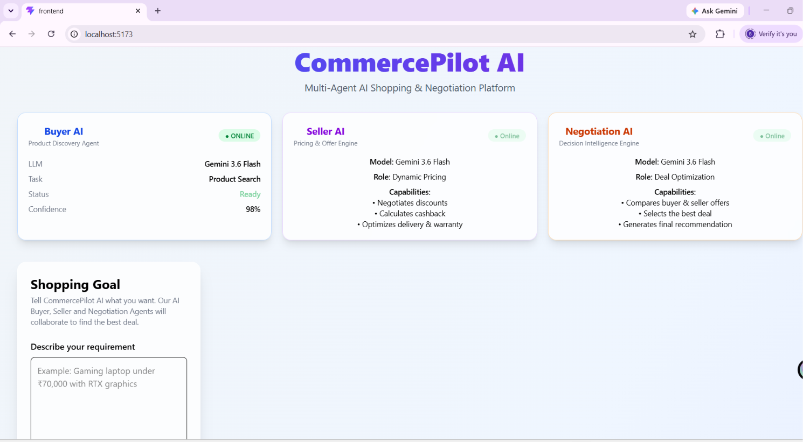
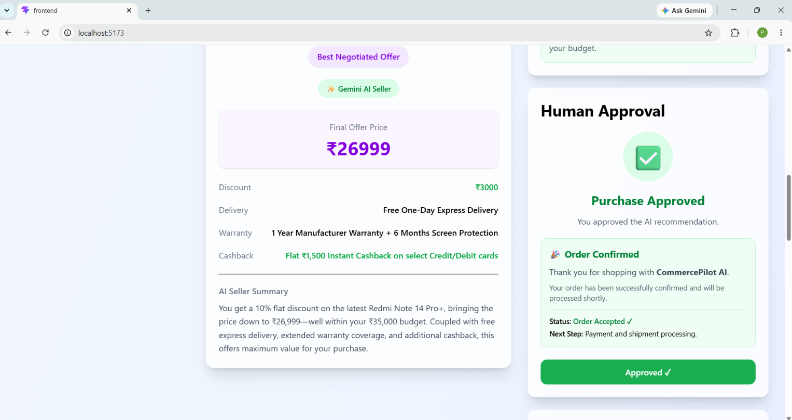
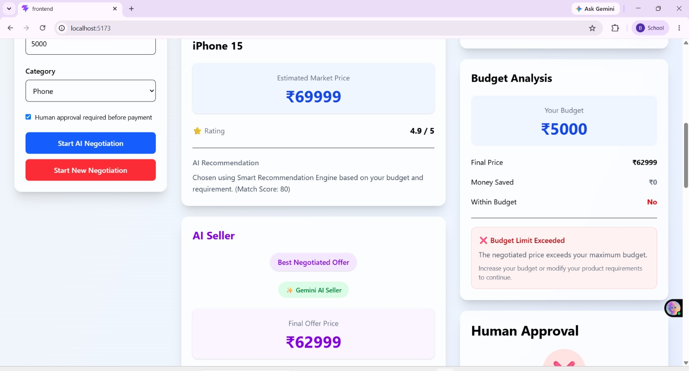
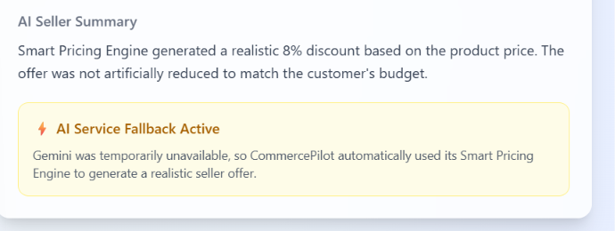
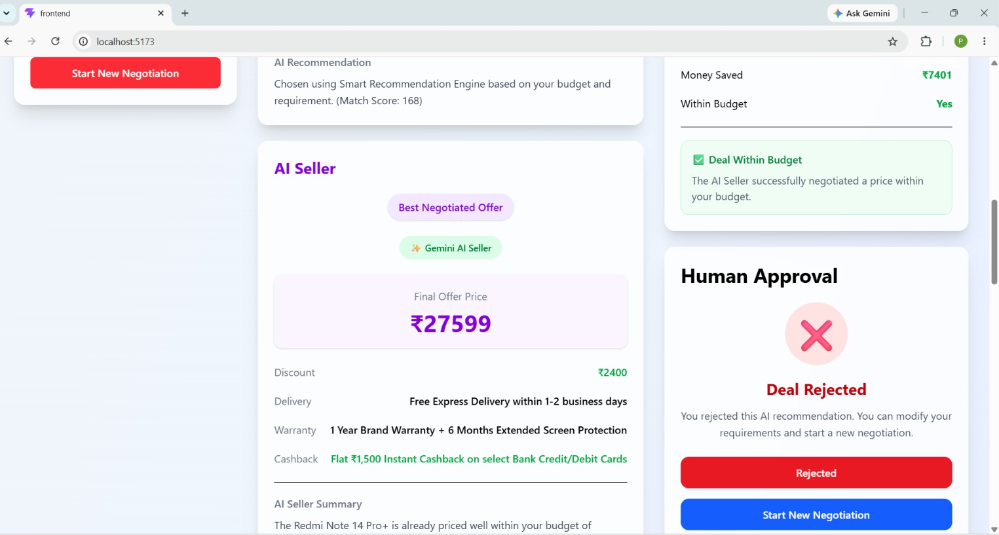

# CommercePilot AI

**Track:** AI Growth & Agentic Commerce

CommercePilot AI is a multi-agent shopping and negotiation platform that simulates an AI buyer, AI seller, and negotiation engine to help users discover products, negotiate offers, and make a final human-approved decision.

## Problem Statement

Shopping today is often a one-way process: users search, compare, and decide manually, while pricing and negotiation remain opaque. CommercePilot AI solves this by turning shopping into a multi-agent workflow where an AI buyer discovers the right product, an AI seller generates a realistic offer, and a negotiation agent simulates a bounded conversation before human approval.

The goal is to make product selection, offer generation, and negotiation explainable, auditable, and resilient to failure. This fits the AI Growth & Agentic Commerce track, where money-related actions should be bounded, gated, and backed by an audit trail and failure handling.


## How It Works

1. The user enters a shopping goal, budget, and category.
2. The Buyer Agent selects a suitable product from the catalog.
3. The Seller Agent generates a realistic offer, delivery, warranty, and cashback.
4. The Negotiation Agent simulates the conversation between buyer and seller.
5. The system checks whether the final offer fits the user's budget.
6. If the deal is acceptable, the Human Approval step lets the user approve or reject it.
7. Every negotiation is saved in a timeline and exported as a PDF report.

This keeps the process explainable, bounded, gated, and auditable.


## Architecture

### Frontend
- React-based dashboard
- Shopping goal form
- Buyer, Seller, Decision, Budget, Approval, and Analytics cards
- Timeline view
- PDF export

### Backend
- Node.js + Express API
- `/api/negotiate` route
- Buyer Agent
- Seller Agent
- Negotiation Agent
- Product image service

### AI / Logic
- Buyer Agent selects the best product from the catalog
- Seller Agent generates a realistic negotiated offer
- Negotiation Agent simulates the conversation
- Budget check decides whether the deal can continue
- Human Approval ensures the final decision is gated

### Failure Handling
- Gemini failure → Smart Pricing Engine fallback
- Budget too low → Negotiation Failed
- Human reject → Deal Rejected
- Product not found → Safe fallback response

### Auditability
- Full negotiation timeline
- Human approval state
- PDF report export


## Features

- Multi-agent shopping workflow
- AI Buyer product selection
- AI Seller dynamic offer generation
- Negotiation conversation timeline
- Human-in-the-loop approval
- Budget check and failure handling
- Gemini fallback to Smart Pricing Engine
- Dynamic product image loading
- PDF report export
- Clear audit trail for every negotiation

## Setup and Run

### Backend
```bash
cd backend
npm install
npm run dev


### Environment Variables

Create a `.env` file in the `backend` folder:

```env
GEMINI_API_KEY=gemini_key
SERPAPI_KEY=serpapi_key
  ```

## Demo / Screenshots

### Home page


### Successful negotiation


### Budget failure


### Gemini fallback


### Human approval



## Why It Stands Out

- Uses a real multi-agent workflow instead of a single chatbot.
- Shows both successful and failure cases clearly.
- Includes graceful fallback when Gemini is unavailable.
- Keeps the final decision human-approved.
- Generates an audit trail and PDF report for every negotiation.


## Link to visit Website

👉 [GitHub Repository](https://github.com/PriyanshuKumari1409/CommercePilot-AI)
